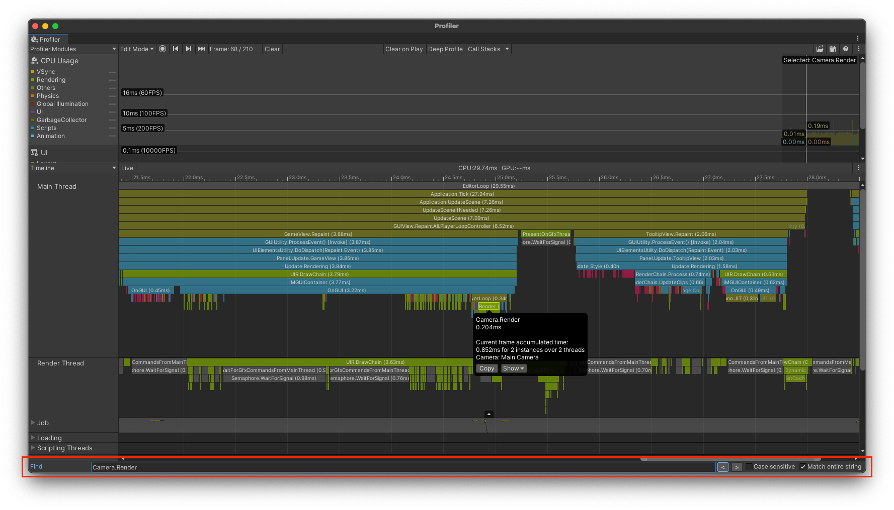

# Unity-ProfilerSearch
This package adds search functionality to the Unity Profiler. It supports searching both forwards and backwards through captures.

## Disclaimer
This package is experimental. It has only been lightly tested on versions of Unity between 2021.1.0 - 2022.3.5, and does not yet support 2020 or 2019 at all.

Bug reports, feature requests, etc. are welcome.

## Installation
Install via the Unity Package Manager's [git URL](https://docs.unity3d.com/2021.1/Documentation/Manual/upm-ui-giturl.html) option

## Usage
- Open the tool via the `Window -> Profiler Search` menu.

- In `Inject into Profiler Window` mode, the search UI will appear at the bottom of the profiler window. (Note: not available in 2021.1 or earlier)
- In `Standalone Window` mode, the search UI will appear in its own window. This mode requires slightly more UI real estate than injection mode, but can be positioned however you choose.

## Known Issues

- Will not work in Unity versions prior to 2021.1. Support for 2019.4 & 2020 is on the todo list.
- Searching through large captures can take a couple of seconds in the worst cases.
- Search text does not persist following a script reload.